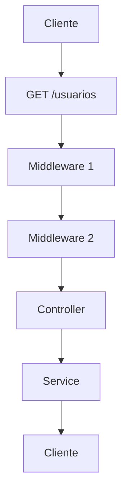

- Função que fica no meio do caminho, entre a requisição do cliente e a resposta da aplicação
- Pode funcionar para todas as rotas (globalmente), ou ser definido para uma rota individualmente 
- Normalmente segue o seguinte fluxo: 


### Middleware no Express
```js
app.use(express.json());

app.use(express.static("public"));
```

## Middleware de Erro

Middleware espacializado em capturar e tratar erros, durante o processamento de uma requisição

Assinatura:
```js
(err, req, res, next)
// err é o que define um middleware de erro
```
