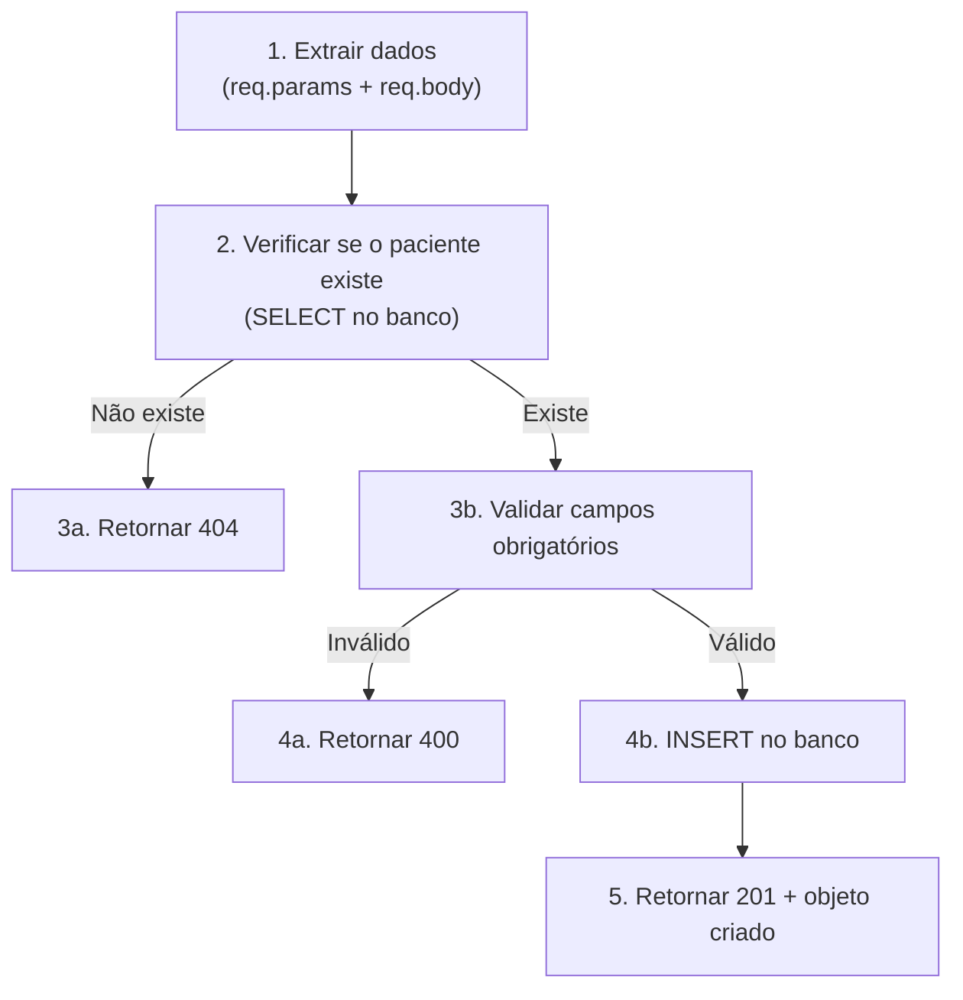
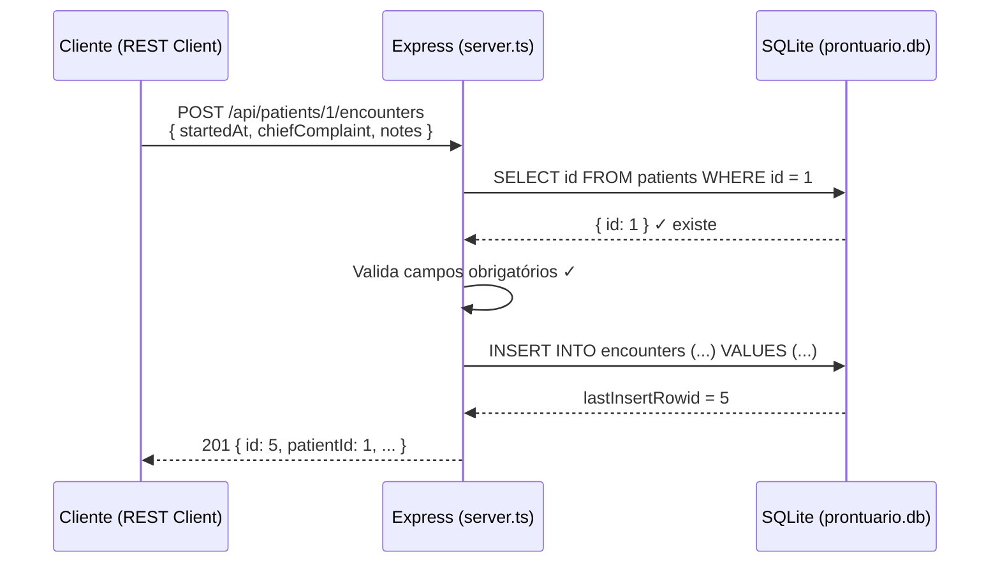

# Criando a Rota POST para Cadastro de Encontros (Encounters)

## Contexto do Projeto

O **Mini-Prontuário** é uma API Express + SQLite que gerencia **pacientes** (`patients`) e **atendimentos/encontros** (`encounters`). O vocabulário é inspirado no padrão HL7 FHIR.

A tabela `encounters` já está criada no [`schema.sql`](file:///home/paulo/Projetos/01-projeto-base/01-projeto-base/database/schema.sql#L35-L45):

```sql
CREATE TABLE encounters(
  id                INTEGER PRIMARY KEY AUTOINCREMENT,
  patient_id        INTEGER NOT NULL,
  started_at        TEXT    NOT NULL,
  chief_complaint   TEXT    NOT NULL,
  notes             TEXT,

  CONSTRAINT FK_patients_encounters
    FOREIGN KEY (patient_id) REFERENCES patients(id)
    ON DELETE CASCADE
);
```

E o arquivo [`requests.http`](file:///home/paulo/Projetos/01-projeto-base/01-projeto-base/requests.http#L75-L101) já define os casos de teste esperados. Agora falta a **rota no servidor**.

---

## Qual é o endpoint?

```
POST /api/patients/:id/encounters
```

### Por que esse caminho?

Porque o encontro **pertence** a um paciente — é um recurso *aninhado* (nested resource). O `:id` na URL identifica **qual** paciente receberá o novo encontro. Esse padrão RESTful expressa a relação de forma natural:

| Verbo | Rota | Significado |
|-------|------|-------------|
| `GET` | `/api/patients/1/encounters` | Listar todos os encontros do paciente 1 |
| `POST` | `/api/patients/1/encounters` | **Criar** um novo encontro para o paciente 1 |

---

## Anatomia da Rota

A rota pode ser dividida em **5 responsabilidades** sequenciais:



---

## O Código, Linha por Linha

Abaixo está a implementação completa que ficaria em [`server.ts`](file:///home/paulo/Projetos/01-projeto-base/01-projeto-base/src/server.ts), após as rotas de `patients`:

```typescript
// ============================================================
// POST /api/patients/:id/encounters  ->  Cadastrar um encontro
// ============================================================
app.post("/api/patients/:id/encounters", (req, res) => {

  // -----------------------------------------------------------
  // 1. EXTRAIR DADOS
  // -----------------------------------------------------------
  // O :id vem da URL (req.params). O corpo vem do JSON (req.body).
  const patientId = Number(req.params.id);
  const { startedAt, chiefComplaint, notes } = req.body;

  // -----------------------------------------------------------
  // 2. O PACIENTE EXISTE?
  // -----------------------------------------------------------
  // Antes de criar um encontro, precisamos garantir que o paciente
  // referenciado realmente existe no banco. Sem isso, o INSERT falharia
  // por violação de chave estrangeira — mas queremos um erro amigável.
  const patient = db
    .prepare("SELECT id FROM patients WHERE id = ?")
    .get(patientId);

  if (!patient) {
    // 404 = "Not Found" — o recurso-pai não existe
    return res.status(404).json({ error: "Paciente não encontrado." });
  }

  // -----------------------------------------------------------
  // 3. VALIDAR CAMPOS OBRIGATÓRIOS
  // -----------------------------------------------------------
  // chiefComplaint é NOT NULL na tabela — obrigatório.
  // startedAt também é NOT NULL.
  // notes é opcional (pode ser null).
  if (!startedAt || !String(startedAt).trim()) {
    return res
      .status(400)
      .json({ error: "O campo 'startedAt' é obrigatório." });
  }

  if (!chiefComplaint || !String(chiefComplaint).trim()) {
    return res
      .status(400)
      .json({ error: "O campo 'chiefComplaint' é obrigatório." });
  }

  // -----------------------------------------------------------
  // 4. INSERIR NO BANCO
  // -----------------------------------------------------------
  // db.prepare(...).run() executa o INSERT e retorna um objeto
  // com { changes, lastInsertRowid }.
  // - changes: quantas linhas foram afetadas (aqui, sempre 1)
  // - lastInsertRowid: o id gerado pelo AUTOINCREMENT
  const result = db
    .prepare(
      `INSERT INTO encounters (patient_id, started_at, chief_complaint, notes)
       VALUES (?, ?, ?, ?)`
    )
    .run(patientId, startedAt, chiefComplaint, notes ?? null);

  // -----------------------------------------------------------
  // 5. RESPONDER COM 201 + OBJETO CRIADO
  // -----------------------------------------------------------
  // 201 = "Created" — o recurso foi criado com sucesso.
  // Devolvemos o objeto no formato camelCase (padrão JSON),
  // não no snake_case do banco.
  res.status(201).json({
    id: result.lastInsertRowid,
    patientId,
    startedAt,
    chiefComplaint,
    notes: notes ?? null,
  });
});
```

---

## Dissecando Cada Parte

### 1. `req.params` vs `req.body`

| Origem | Objeto Express | Exemplo |
|--------|---------------|---------|
| **URL** (`/api/patients/1/encounters`) | `req.params.id` → `"1"` | Identifica *qual* paciente |
| **Corpo JSON** | `req.body` → `{ startedAt, chiefComplaint, notes }` | Os dados do *novo* recurso |

> [!IMPORTANT]
> `req.params.id` é **sempre uma string**. Por isso fazemos `Number(req.params.id)` antes de usar no SQL.

### 2. Verificação de existência do paciente (404)

```typescript
const patient = db
  .prepare("SELECT id FROM patients WHERE id = ?")
  .get(patientId);
```

- `.get()` retorna **uma linha** ou `undefined`.
- Se `undefined`, o paciente não existe → responde **404**.
- Sem essa verificação, o SQLite lançaria um erro de FK, mas a mensagem seria críptica para o cliente.

> [!TIP]
> Esse padrão ("verifica o pai antes de inserir o filho") é muito comum em APIs REST com recursos aninhados.

### 3. Validação (400)

O banco define `NOT NULL` nos campos, mas confiar apenas no banco para validar tem problemas:
- A mensagem de erro do SQLite não é amigável
- Não há distinção entre *qual* campo está faltando
- O cliente precisa de feedback claro

Por isso validamos **antes** do INSERT:

```typescript
if (!chiefComplaint || !String(chiefComplaint).trim()) {
  return res.status(400).json({ error: "O campo 'chiefComplaint' é obrigatório." });
}
```

A lógica `!valor || !String(valor).trim()` cobre:
- `undefined` (campo ausente no JSON)
- `""` (string vazia)
- `"   "` (somente espaços)

### 4. O INSERT e o `run()`

```typescript
const result = db
  .prepare("INSERT INTO encounters (...) VALUES (?, ?, ?, ?)")
  .run(patientId, startedAt, chiefComplaint, notes ?? null);
```

| Conceito | Explicação |
|----------|-----------|
| `?` (placeholders) | Previne **SQL Injection**. O `better-sqlite3` escapa os valores automaticamente. |
| `.run()` | Usado para `INSERT`, `UPDATE`, `DELETE` — comandos que **modificam** dados. |
| `.all()` | Usado para `SELECT` — comandos que **leem** dados. |
| `notes ?? null` | O operador `??` (nullish coalescing): se `notes` for `undefined`, envia `null` para o banco. |
| `result.lastInsertRowid` | O `id` gerado automaticamente pelo `AUTOINCREMENT`. |

### 5. A resposta 201

```typescript
res.status(201).json({ ... });
```

- **201 Created** — código HTTP que significa "recurso criado com sucesso".
- Devolvemos o objeto criado para que o cliente saiba o `id` gerado e possa usá-lo imediatamente.
- Os campos são em **camelCase** (padrão JavaScript/JSON), diferente do **snake_case** usado no banco SQL.

---

## Mapa de Status HTTP Usados

| Status | Significado | Quando |
|--------|-------------|--------|
| **201** | Created | Encontro cadastrado com sucesso |
| **400** | Bad Request | Campo obrigatório ausente ou inválido |
| **404** | Not Found | `patientId` não existe na tabela `patients` |

---

## Fluxo Completo de uma Requisição Válida



---

## Onde esse código entra no [`server.ts`](file:///home/paulo/Projetos/01-projeto-base/01-projeto-base/src/server.ts)?

Ele deve ficar **após** as rotas de `patients` (depois da linha 83) e **antes** do `app.listen()` (linha 86). A posição ideal é entre os comentários do `TODO 3` e o `app.listen`.

---

## Checklist Rápido

- [x] Tabela `encounters` criada no [`schema.sql`](file:///home/paulo/Projetos/01-projeto-base/01-projeto-base/database/schema.sql)
- [ ] Rota `POST /api/patients/:id/encounters` em [`server.ts`](file:///home/paulo/Projetos/01-projeto-base/01-projeto-base/src/server.ts)
- [ ] Rota `GET /api/patients/:id/encounters` (listar encontros — complementar)
- [ ] Testar com [`requests.http`](file:///home/paulo/Projetos/01-projeto-base/01-projeto-base/requests.http) (testes 10 a 13)
