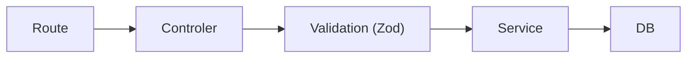

Antes de começa é exigido conhecimento profundo sobre os Status code: 
- 200, 201, 204
- 400, 404, 409,, 413, 422 e 500
- O que significa a API ser Stateless

## Layered Architecture 

- modularity, separation of concerns and maintainability
- Idempotência e safety
### headers 

- content-type
- accept
- location
## Introdução 
- Objective: modularity, separation of concerns and maintainability
- A ideia é separar as responsabilidades. Até o momento nossas rotas concentram: validação, regra de negócio, SQL e formatação de resposta
## Anatomia

**Route** --> **Controller** --> **Service**

- Por enquanto focando só nos três

![[Pasted image 20260919171119.png]]

design pattern 