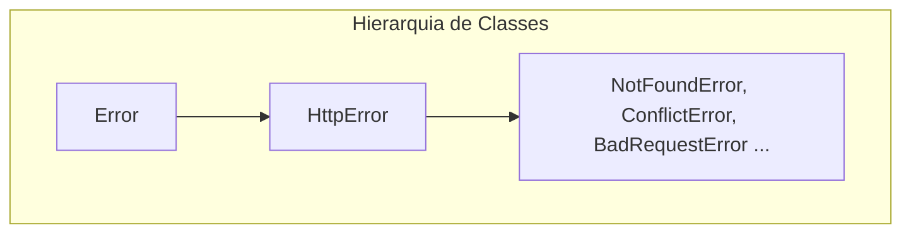

# Tratando erros em APIs Rest

- O problema: Respostas inconsistentes, desorganização e vazamentos de implementação
- Solução: Error Handler centralizado
---

- try...catch é um error handler 
### tratar error != corrigir error

Tratar = saber identificar, capturar e devolver uma mensagem adequada
Corrigir = efetivamente eliminar o erro

## 1. HttpError + middleware central + Express 5

Essa é a solução inicial para o problema apresentado
### A ouvidoria única

- Todo tratamento de error saí do mesmo local.
- Ideia é criar abstrações para erros, usar a caracteristica do Express 5 para capturar o erro e assim acionar o middleware de erros
### [[middleware#Middleware de Erro|Middlewares de erro]]
A ideia é criar um arquivo contendo a abstração de todos os erros

E depois um middleware global de error para chamar um erro especifico