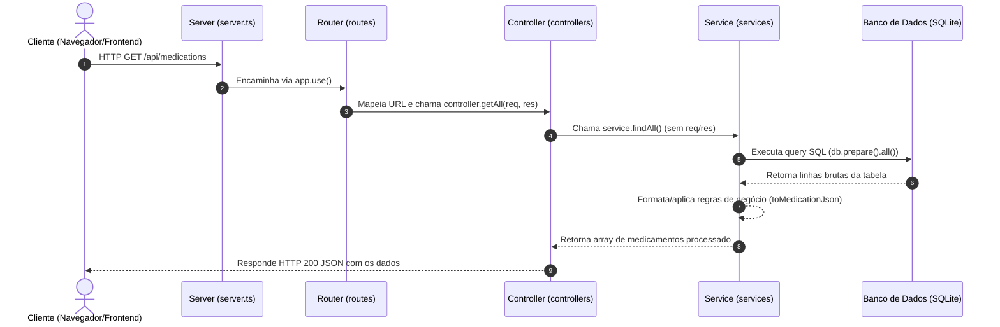

# Guia e Anotações de Estudo: Arquitetura em Camadas

Este documento sintetiza os conceitos, discussões, dúvidas conceituais e correções realizadas durante o processo de refatoração do projeto **Painel de Medicação** para uma **Arquitetura em Camadas** (*Layered Architecture*).

---

## 1. O Fluxo da Aplicação

Em uma aplicação web baseada em camadas no Node.js com Express, o fluxo de uma requisição segue um ciclo de **ida e volta**:



> [!IMPORTANT]
> **Regra de Ouro**: O fluxo **sempre volta pelo Controller**. O Service nunca deve devolver a resposta diretamente ao cliente, nem ter acesso aos objetos `req` ou `res`.

---

## 2. Conceitos e Responsabilidades de Cada Camada

| Camada         | Arquivo de Exemplo                | Conhece HTTP / Express?         | Responsabilidade Principal                                                                                                                                         |
| :------------- | :-------------------------------- | :------------------------------ | :----------------------------------------------------------------------------------------------------------------------------------------------------------------- |
| **Server**     | `src/server.ts`                   | **Sim**                         | Configurar o Express, middlewares globais (`express.json()`, `express.static()`), plugar os roteadores e inicializar a porta (`app.listen()`).                     |
| **Route**      | `src/routes/*.route.ts`           | **Sim** (apenas `Router`)       | Declarar as rotas (método HTTP + URI) e associá-las às ações do respectivo Controller.                                                                             |
| **Controller** | `src/controllers/*.controller.ts` | **Sim** (`Request`, `Response`) | Receber a requisição HTTP, extrair dados (`params`, `body`, `query`), chamar o Service, tratar exceções (`try/catch`) e enviar a resposta (`res.status().json()`). |
| **Service**    | `src/services/*.service.ts`       | **NÃO**                         | Lógica de negócio, regras do domínio, cálculos e persistência de dados. Recebe e retorna dados puros (JavaScript/TypeScript).                                      |

---

## 3. Respostas às Dúvidas Conceituais

### Dúvida 1: *Quando chega no service, o percurso é voltar pelo controller ou já manda para o cliente?*
* **Resposta:** Sempre volta pelo Controller.
* **Por quê?**
  1. **Desacoplamento:** O Service deve ser independente de plataforma. Se amanhã você quiser usar essa mesma regra em uma fila de mensagens, uma tarefa cron agendada, um script CLI ou testes unitários sem servidor HTTP, o Service funcionará sem alterações.
  2. **Separação de Preocupações (*SoC*):** O Controller cuida dos detalhes de transporte (códigos HTTP 200, 201, 400, 404, 500, headers, cookies). O Service cuida exclusivamente da lógica do negócio.

### Dúvida 2: *Qual a diferença entre `Express` e `express`?*
> Erro comum: `'"express"' has no exported member named 'express'. Did you mean 'Express'?ts(2724)`
* **`express` (minúsculo, função padrão):** É a função padrão exportada pela biblioteca (o *default export*). É usada para criar a aplicação:
  ```ts
  import express from "express"; // Correto
  const app = express();
  ```
  Se você tentar importar `{ express }` com chaves, o TypeScript reclama porque ela não é um *named export*.
* **`Express` (maiúsculo, namespace de tipos):** Representa os tipos internos do TypeScript fornecidos pela `@types/express`. Por exemplo:
  ```ts
  import express, { Request, Response, Router } from "express";
  ```

---

## 4. Diagnóstico dos Erros Cometidos e Lições Aprendidas

### ❌ Erro 1: O Service tentando ser Server e Controller
* **O que foi feito:** No arquivo `medication.service.ts`, foram criadas instâncias do Express (`const app = express()`), porta HTTP (`app.listen(PORT)`), e métodos que recebiam `(req: Request, res: Response)` e chamavam `res.send()`.
* **Por que é problemático:** Subvertia completamente a separação de camadas. O Service virava o ponto de entrada da aplicação e se acoplava ao Express.
* **Correção:** Remover qualquer referência a `express()`, `app.listen`, `req` e `res` do Service. O Service deve conter métodos como `findAll(): Medication[]`.

---

### ❌ Erro 2: `Route` chamando o `Service` diretamente
* **O que foi feito:** O arquivo de rotas ignorava o Controller e invocava o Service diretamente (`service.get(req, res)`).
* **Por que é problemático:** Pula a camada responsável pela tradução da requisição HTTP para o domínio.
* **Correção:** A rota sempre delega para o Controller:
  ```ts
  router.get("/", (req, res) => medicationController.getAll(req, res));
  ```

---

### ❌ Erro 3: Erro `404 (Not Found)` em `/api/medications`
* **O que foi feito:** O servidor Express estava rodando no `server.ts`, mas a rota retornava 404 no navegador.
* **Causa Raiz:** O elo entre **Server** e **Router** não existia:
  1. `medication.route.ts` definiu o `router`, mas **não o exportava** (`export default router;`).
  2. `server.ts` **não importava** o arquivo de rotas nem registrava via `app.use("/api/medications", router)`.
* **Correção:** Exportar o `router` no arquivo de rotas e registrá-lo no `server.ts`.

---

### ❌ Erro 4: Tratamento de Erros com `throw` no Controller
* **O que foi feito:** No bloco `catch` do Controller:
  ```ts
  } catch(error) {
    throw new Error("Ocorreu um error");
  }
  ```
* **Por que é problemático:** O Controller é a última camada antes da rede. Se ele lançar um `throw` sem um middleware global de erros, a requisição pode ficar pendente no cliente ou o processo Node.js pode cair.
* **Correção:** O Controller deve capturar o erro e enviar uma resposta HTTP apropriada:
  ```ts
  } catch(error) {
    console.error(error);
    return res.status(500).json({ error: "Erro interno do servidor" });
  }
  ```

---

### ❌ Erro 5: Consulta SQL incompleta com `better-sqlite3`
* **O que foi feito:**
  ```ts
  findAll() {
    const medications = db.prepare(`SELECT * FROM medication_orders`);
    return medications;
  }
  ```
* **Por que é problemático:** No `better-sqlite3`, `db.prepare()` apenas compila a declaração SQL (*prepared statement*). Ele **não executa** a busca. Além disso, as colunas do banco estão em `snake_case` e a interface espera `camelCase`.
* **Correção:** Chamar o método `.all()` para executar e mapear para o formato do JSON esperado:
  ```ts
  findAll() {
    const rows = db.prepare(`SELECT * FROM medication_orders`).all() as MedicationRow[];
    return rows.map(toMedicationJson);
  }
  ```

---

## 5. Estrutura de Arquivos Recomendada

```text
src/
├── database.ts                      # Instância e conexão com o SQLite
├── server.ts                        # Inicialização do Express, middlewares e rotas
├── routes/
│   └── medication.route.ts          # Mapeia endpoints para métodos do Controller
├── controllers/
│   └── medication.controller.ts     # Recebe (req, res), valida HTTP, chama Service
└── services/
    └── medication.service.ts        # Regras de negócio e consultas ao banco
```

---

## 6. Próximos Estudos e Aprofundamentos

Para detalhes sobre implementação da busca por ID, tratamento de tipos no Express 5 e estratégias de retorno (null vs erro), consulte:
* [Anotações de Busca por ID, Tipagem e Validação em Camadas](file:///home/paulo/Projetos/ADS%20-%20MEU/IMPLEMENTACAO/Desenvolvimento%20Web/Prog.%20Internet%20II/2%20-%20Arquitetura/atividades/atividadeC/RefatorandoB/anotacoes_busca_id_validacao_e_tipagem.md)

