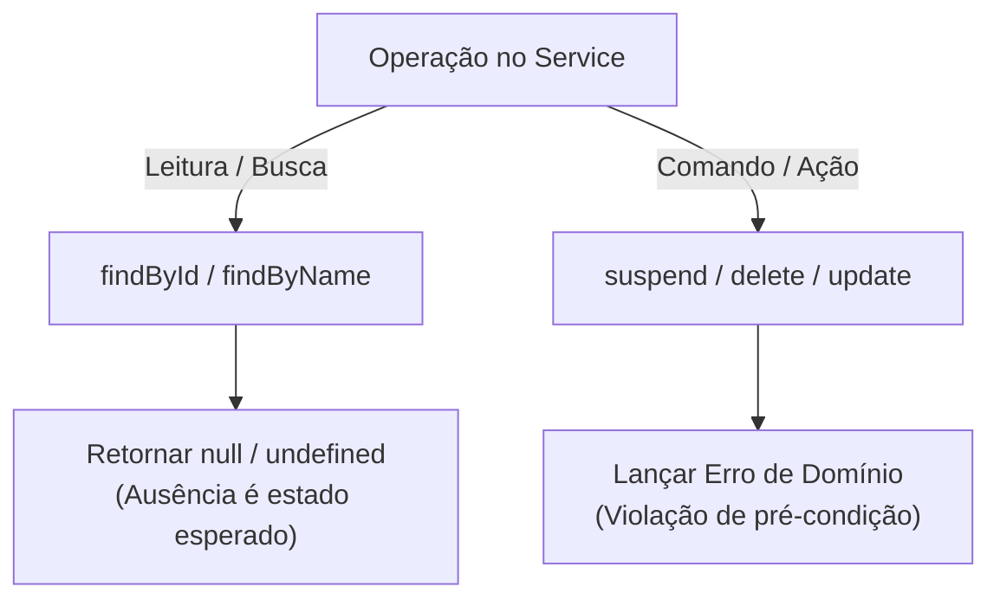

# Anotações de Estudo: Busca por ID, Tipagem no TypeScript e Validação em Camadas

Este documento consolida os conceitos, decisões arquiteturais, armadilhas de tipagem e boas práticas discutidos durante a implementação do fluxo de **busca por ID (`findById` / `getById`)** no projeto **Painel de Medicação**.

---

## 1. O Problema do Type Assertion (`as`) vs. Realidade do Banco de Dados

### O Cenário Inicial
No arquivo `medication.service.ts`:
```typescript
function find(id: number) {
  const medicationOrder = db.prepare(`SELECT * FROM medication_orders WHERE id = ?`).get(id) as medicationRow;
  const medication = toMedicationJson(medicationOrder);
}
```

### O Diagnóstico
1. **O que é o `as` (Type Assertion)?**
   * É uma instrução direta ao compilador TypeScript que diz: *"Confie em mim, eu sei mais que você. O tipo deste valor é estritamente `medicationRow`"*.
2. **A realidade em tempo de execução (*runtime*):**
   * A biblioteca `better-sqlite3` retorna a linha encontrada **ou** `undefined` caso o registro com aquele `id` não exista na tabela.
3. **A quebra em produção:**
   * Quando o ID não existe, `medicationOrder` recebe `undefined`.
   * Na linha seguinte, `toMedicationJson(medicationOrder)` tenta ler propriedades como `row.id` de `undefined`.
   * **Resultado:** `TypeError: Cannot read properties of undefined (reading 'id')`. O TypeScript não avisou porque o programador forçou a tipagem com `as`.

### Por que o operador de coalescência nula (`??`) não resolveu?
* O operador `a ?? b` fornece um valor substituto `b` apenas se `a` for `null` ou `undefined`.
* Para entidades de banco de dados:
  * Não faz sentido criar um registro "fantasma" ou com valores inventados quando algo não existe.
  * Fazer `toMedicationJson(...) ?? null` não protege a execução, pois o erro estoura **dentro** da função `toMedicationJson` antes mesmo do `??` ser avaliado.

### A Solução Correta: Tipagem Honesta e *Guard Clause*
1. **Dizer a verdade ao compilador:** Declarar que o retorno é `medicationRow | undefined`.
2. **Cláusula de Guarda (*Guard Clause*):** Tratar a ausência imediatamente com um retorno antecipado (`early return`).

```typescript
function findById(id: number) {
  const medicationOrder = db
    .prepare(`SELECT * FROM medication_orders WHERE id = ?`)
    .get(id) as medicationRow | undefined;

  // Se não existir no banco, interrompe e retorna null
  if (!medicationOrder) {
    return null;
  }

  // O TypeScript aplica "Type Narrowing": aqui dentro ele tem certeza de que é medicationRow
  return toMedicationJson(medicationOrder);
}
```

---

## 2. Divisão de Responsabilidades: Service vs. Controller

### A Grande Questão
> *"De quem é a responsabilidade de tratar caso o registro não seja encontrado: do Service ou do Controller?"*

### A Resposta Arquitetural
A responsabilidade é **dividida entre os dois**, com papéis bem delimitados:

| Camada | Papel no Cenário "Não Encontrado" | Por que age assim? |
| :--- | :--- | :--- |
| **Service** (Lógica de Domínio) | Comunica o **fato**: *"Procurei no banco e o registro não existe, retorno `null`"*. | **Independência de Transporte:** O Service não sabe o que é Web, HTTP, status 404, `req` ou `res`. Ele opera com dados puros. |
| **Controller** (Lógica de Apresentação) | Traduz o fato para o **cliente**: *"O Service retornou `null`, então respondo com `HTTP 404 Not Found`"*. | **Fronteira com a Rede:** O Controller é quem conhece o protocolo HTTP e formata o status code e a mensagem JSON para o consumidor. |

### O Princípio da Reutilização
Se o Service gerasse uma resposta HTTP 404 diretamente, ele ficaria **acoplado à Web**. Se amanhã esse mesmo Service precisasse ser executado por:
* Um script CLI (linha de comando);
* Uma tarefa agendada (*Cron Job*);
* Um consumidor de filas (RabbitMQ, Kafka);
* Testes unitários automatizados;

Ele quebraria, pois nenhum desses ambientes possui os objetos `req` ou `res` do Express. Retornando `null`, o Service pode ser reutilizado em qualquer contexto.

---

## 3. Estratégias de Retorno no Service: `null` vs. Lançar Erros

Existem duas abordagens consolidadas para quando um registro não é encontrado:



### Abordagem A: Retornar `null` (Recomendada para Buscas)
* **Quando usar:** Em métodos de leitura (`find`, `findById`).
* **Motivo:** Buscar um ID que não existe na web é uma situação rotineira e previsível. Em linguagens modernas, exceções devem ser reservadas para casos excepcionais (falhas de conexão, dados corrompidos).
* **Vantagem no TypeScript:** O tipo de retorno `Medication | null` obriga o Controller a escrever um `if (!medication)`, tornando o fluxo explícito e à prova de esquecimentos.

### Abordagem B: Lançar Erro de Domínio (Recomendada para Ações)
* **Quando usar:** Em operações que **exigem** a existência da entidade para que a ação tenha sentido (ex: suspender uma medicação em `suspend(id)`).
* **Motivo:** Tentar cancelar algo que não existe viola uma regra de negócio.
* **Uso avançado:** Em APIs que possuem um *Middleware Global de Erros* no Express, o Controller apenas chama o Service, e qualquer erro lançado é capturado centralizadamente e mapeado para o status code correto (ex: `NotFoundError` vira 404).

---

## 4. Express 5 e o Erro `ts(2345)` em `req.params`

### O Erro
```text
Argument of type 'string | string[]' is not assignable to parameter of type 'string'.
  Type 'string[]' is not assignable to type 'string'.ts(2345)
```

### A Causa
No **Express 5** (`@types/express` v5), os parâmetros de rota (`req.params`) são tipados como:
`string | string[]`

Isso ocorre porque parâmetros curinga (*wildcards*) ou rotas complexas podem capturar múltiplos segmentos de URL como um array de strings. Como a função do Service esperava um valor único, o TypeScript bloqueou a compilação por segurança.

### A Semântica da Checagem: Lista Negra vs. Lista Branca (Blocklist vs. Allowlist)

Em código profissional, preferimos sempre a abordagem defensiva de **garantir o que queremos** (*allowlist*) em vez de tentar adivinhar e barrar apenas o que não queremos (*blocklist*).

> [!NOTE]
> **Reflexão Socrática de Código:**
> *"Em vez de tentar listar o que não queremos, não seria muito mais direto, seguro e legível checar simplesmente se `typeof id !== "string"`?"*

#### ❌ Abordagem 1: Lista Negra (*Blocklist*) via `typeof id == "object"`
```typescript
if (typeof id == "object") {
  return res.status(400).json({ error: "id inválido" });
}
```
* **Problema:** Em JavaScript, `typeof [] === "object"`, então o TypeScript até deduz que descartamos `string[]`. Porém:
  * **Falsa segurança:** Se `id` por ventura for `undefined`, o `typeof undefined` é `"undefined"` (e não `"object"`), passando despercebido pelo teste!
  * **Intenção oculta:** É uma abordagem frágil e pouco intuitiva, pois obriga quem lê o código a deduzir que `"object"` é um artifício para barrar arrays.

#### ✅ Abordagem 2: Lista Branca (*Allowlist*) com `typeof id !== "string"`
```typescript
if (typeof id !== "string") {
  return res.status(400).json({ error: "id inválido" });
}
```
* **Vantagem:** Direta, explícita e declarativa. Garante que `id` é estritamente uma string única. Qualquer outra coisa (`undefined`, array, número, objeto) é barrada imediatamente com precisão.

---

## 5. Validação Defensiva e Semântica HTTP (400 vs. 404)

Ao construir endpoints REST que recebem identificadores na rota, é essencial distinguir a natureza do erro:

| Cenário | Entrada de Exemplo | Status HTTP Correto | Significado |
| :--- | :--- | :--- | :--- |
| **Erro Sintático do Cliente** | `/medications/abc`<br/>`/medications/-5`<br/>`/medications/2.5` | **400 Bad Request** | O cliente enviou um dado malformado que não respeita o contrato da API. Não faz sentido consultar o banco. |
| **Recurso Inexistente** | `/medications/999` (id válido, mas não cadastrado) | **404 Not Found** | A requisição é sintaticamente perfeita, a busca foi feita no banco, mas a entidade não existe. |

### Validação Segura de IDs Numéricos

```typescript
// 1. Garante que veio como string única da URL
if (typeof id !== "string") {
  return res.status(400).json({ error: "id inválido" });
}

// 2. Converte para número
const numericId = Number(id);

// 3. Validação robusta de chave primária inteira e positiva
if (!Number.isInteger(numericId) || numericId <= 0) {
  return res.status(400).json({ error: "O id deve ser um número inteiro positivo" });
}

// 4. Passa a variável JÁ validada para o Service (evitando conversões redundantes)
const medication = medicationService.findById(numericId);
```

> [!TIP]
> **Por que preferir `Number.isInteger(n)` a `isNaN(n)`?**
> * `isNaN("2.5")` é `false` (ou seja, aceitaria números decimais).
> * `Number.isInteger(2.5)` é `false` (garante que chaves primárias do banco sejam inteiros).
> * `Number.isInteger(NaN)` é `false` (já elimina `NaN` automaticamente).

---

## 6. Resumo das Lições Aprendidas

1. **Nunca use `as` para mascarar incertezas de *runtime*:** Sempre modele o retorno do banco como `Tipo | undefined` e use *guard clauses* para garantir a integridade dos dados.
2. **O Service dita o negócio, o Controller dita o protocolo:** Mantenha o Service livre de qualquer referência HTTP para garantir testabilidade e reuso.
3. **Trate o Express 5 com *Type Narrowing* explícito:** Use `typeof param !== "string"` para trabalhar com segurança sobre `req.params`.
4. **Diferencie 400 de 404:** Valide tipos e formatos no Controller antes de sobrecarregar a camada de dados com consultas inválidas.
5. **Evite retrabalho de variáveis:** Se você já converteu e sanitizou um valor (`numericId`), passe essa variável diretamente para as camadas inferiores.
