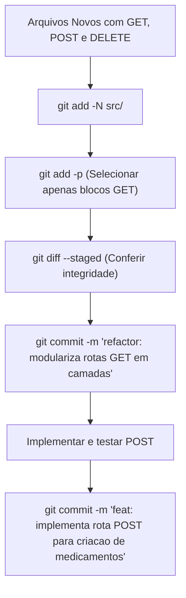

# Guia de Estudo: Organização de Commits, Conventional Commits e Git Profissional

Este material consolida as discussões práticas sobre divisão de commits, semântica de mensagens (Conventional Commits) e técnicas avançadas de gerenciamento de histórico no Git, contextualizadas na refatoração da aplicação **Painel de Medicação** para uma **Arquitetura em Camadas**.

---

## 1. O Problema Prático: Commits Parciais com Arquivos Novos

Ao refatorar uma aplicação (por exemplo, migrando rotas monolíticas do `server.ts` para arquivos distribuídos em `routes/`, `controllers/`, `services/` e `types/`), é comum criar vários arquivos simultaneamente com códigos em diferentes estágios (trechos de `GET` prontos, esqueletos de `POST` e `DELETE` rascunhados ou comentados).

Para manter o histórico limpo e organizado, a boa prática exige **commits atômicos**: registrar primeiro o fluxo que já está concluído e funcional (neste caso, a listagem e busca por ID).

### O Obstáculo do Git com Arquivos *Untracked*
O comando tradicional para escolher trechos específicos de código é o `git add -p` (*patch mode*). No entanto:
> [!WARNING]
> O comando `git add -p` **não funciona** diretamente em arquivos novos (*Untracked files*). Se executado, o Git simplesmente responderá `No changes.` porque o arquivo ainda não existe no índice (*staging area*).

---

## 2. A Solução: `git add -N` e `git add -p`

Para contornar essa limitação sem precisar adicionar o arquivo inteiro de uma só vez, o Git oferece a flag de **intenção de adicionar** (*intent-to-add*):

### Passo 1: Notificar o Git sobre a existência dos arquivos
```bash
git add -N src/
# ou individualmente:
git add -N src/controllers/medication.controller.ts
git add -N src/routes/medication.route.ts
git add -N src/services/medication.service.ts
git add -N src/types/medications.types.ts
```

> [!NOTE]
> O parâmetro `-N` (`--intent-to-add`) registra no índice apenas o caminho do arquivo com conteúdo vazio. O Git passa a tratá-lo como um arquivo monitorado com todas as suas linhas como alterações pendentes, habilitando o uso do `git diff` e `git add -p`.

### Passo 2: Seleção interativa de pedaços (*hunks*)
Com os arquivos monitorados, execute:
```bash
git add -p
```
O Git apresentará bloco por bloco do código e solicitará uma instrução.

#### Tabela de Operações do `git add -p`

| Comando | Nome | Ação |
| :---: | :--- | :--- |
| **`y`** | *yes* | Adiciona o bloco atual ao *stage*. |
| **`n`** | *no* | Não adiciona o bloco atual (permanece no *working directory* para o próximo commit). |
| **`s`** | *split* | Divide o bloco atual em partes menores (útil se o `GET` e o `POST` estiverem muito próximos). |
| **`e`** | *edit* | Abre o editor para você apagar manualmente os `+` das linhas que não quer commitar agora. |
| **`q`** | *quit* | Sai do modo interativo mantendo o que já foi selecionado. |
| **`d`** | *do not apply* | Não adiciona este bloco nem os restantes do arquivo atual. |
| **`?`** | *help* | Exibe a ajuda com todas as opções disponíveis. |

### Passo 3: Verificação antes do Commit
Sempre confira o que efetivamente entrou no *stage*:
```bash
git diff --staged
```

### Alternativa Visual no Editor (VS Code / Antigravity)
Caso prefira não usar o terminal para navegar pelos blocos:
1. Abra a visualização de diferenças do arquivo.
2. Selecione com o mouse as linhas correspondentes à funcionalidade desejada.
3. Clique com o botão direito e escolha **"Stage Selected Ranges"** (*Adicionar Intervalos Selecionados para Preparação*).

---

## 3. Semântica de Commits: `feat` vs `refactor`

A especificação do **Conventional Commits** padroniza a comunicação entre equipes e permite automação de versionamento semântico (*SemVer*) e geração de *changelogs*.

### A Definição Conceitual

* **`feat` (Feature / Funcionalidade):**
  - Adiciona uma **nova capacidade observável** ao sistema pelo usuário final ou consumidor da API.
  - Introduz um novo endpoint que não existia, uma nova regra de negócio ou um novo parâmetro.
  - Altera a versão secundária (*Minor*) no SemVer (ex: `1.0.0` $\rightarrow$ `1.1.0`).

* **`refactor` (Refatoração):**
  - Modifica a **estrutura interna do código sem alterar seu comportamento externo**.
  - O consumidor da API não percebe mudança nas respostas, cabeçalhos, status HTTP ou URLs.
  - Não corrige um defeito (isso seria `fix`) nem adiciona novas capacidades (isso seria `feat`).
  - Altera apenas a versão de patch no SemVer quando empacotado (ex: `1.0.1`).

### Análise do Caso Real (Painel de Medicação)

No nosso projeto:
1. No arquivo original `src/server.ts`, as rotas `GET /api/medications` e `GET /api/medications/:id` **já estavam implementadas e funcionando**.
2. A alteração consistiu em extrair o código de `server.ts` e distribuí-lo entre `routes`, `controllers`, `services` e `types`.
3. Para qualquer cliente HTTP (Postman, Frontend, curl), o comportamento da API continua estritamente o mesmo.

> [!IMPORTANT]
> **Conclusão:** A entrega das rotas GET extraídas para camadas é estritamente um **`refactor`**, e não um `feat`.

#### Exemplos de Mensagens Adequadas:
```bash
# Simples e direto
git commit -m "refactor: modulariza rotas GET de medicamentos em camadas"

# Com escopo definido
git commit -m "refactor(medications): extrai busca para controller e service"

# Completo com corpo explicativo (para histórico formal)
git commit -m "refactor(medications): separa rotas GET na arquitetura em camadas

- Move definicao de rotas para medication.route.ts
- Cria getAll e getById em medication.controller.ts
- Cria findAll e findById em medication.service.ts
- Define tipagem medicationRow em types"
```

---

## 4. Tópico Avançado: Práticas de Git Profissional

No ambiente corporativo e em equipes de alto desempenho, o Git é utilizado como ferramenta de **comunicação, auditoria e resiliência**. A seguir estão as principais práticas que diferenciam o uso amador do profissional.

---

### 4.1. Commits Atômicos (*Atomic Commits*)

Um commit atômico é uma unidade de trabalho indivisível que faz **uma única coisa bem feita**.

#### As Três Regras de Ouro do Commit Atômico:
1. **Compilabilidade Contínua:** Em qualquer commit do histórico que você fizer `git checkout`, a aplicação deve compilar, inicializar e passar nos testes existentes. Nunca commite código pela metade que quebra o build.
2. **Reversibilidade Limpa:** Se aquele commit causar um problema em produção, a equipe pode executar `git revert <hash>` sem quebrar nenhuma outra funcionalidade alheia.
3. **Revisabilidade Ágil:** No *Code Review*, o revisor consegue entender o raciocínio olhando as alterações isoladas daquele commit em poucos minutos.

---

### 4.2. Higiene de Histórico com Rebase Interativo (`git rebase -i`)

Durante o desenvolvimento local de uma funcionalidade, é normal fazer commits rápidos como `"ajuste"`, `"conserta import"`, `"teste"`. **Porém, esses commits nunca devem ir para a branch principal (`main` ou `develop`).**

O rebase interativo permite "lapidar" o histórico local antes de abrir o Pull Request:

```bash
git rebase -i HEAD~4
```

O Git abrirá um arquivo com a lista dos últimos 4 commits e seus comandos:
```text
pick a1b2c3d refactor(routes): cria roteador de medicamentos
pick 4e5f6g7 fix: corrige import do express
pick 8h9i0j1 refactor(controllers): adiciona controller de busca
pick 2k3l4m5 style: remove console.log esquecido
```

#### Comandos Essenciais do Rebase Interativo:
* **`pick` (ou `p`):** Mantém o commit como está.
* **`reword` (ou `r`):** Mantém o código do commit, mas permite reescrever a mensagem.
* **`squash` (ou `s`):** Junta o commit com o commit anterior, combinando as mensagens.
* **`fixup` (ou `f`):** Junta o commit com o commit anterior e **descarta** a mensagem do commit secundário (perfeito para consertos de digitação ou linter).
* **`drop` (ou `d`):** Remove completamente o commit do histórico.

#### O Fluxo Moderno: `--fixup` e `--autosquash`
Em vez de esperar o rebase para lembrar onde colar o ajuste, use o atalho automático:
```bash
# 1. Fez um ajuste que deveria pertencer a um commit anterior específico:
git commit --fixup <hash-do-commit-original>

# 2. Quando terminar a feature, execute o rebase com autosquash:
git rebase -i --autosquash origin/main
# O Git reordena os fixups e aplica o merge automaticamente!
```

---

### 4.3. Resolução Segura de Divergências: `push --force-with-lease`

Depois de organizar seu histórico local com rebase, a sua branch local divergiu da branch remota.
Muitos iniciantes executam:
```bash
git push -f origin minha-branch # PERIGOSO!
```
> [!CAUTION]
> O `git push --force` sobrescreve a branch remota cegamente. Se outro desenvolvedor tiver enviado commits para a sua branch enquanto você trabalhava, esses commits serão **destruídos permanentemente**.

**A alternativa profissional:**
```bash
git push --force-with-lease origin minha-branch
```
O `--force-with-lease` verifica se o seu repositório local conhece o estado exato da branch remota. Se alguém tiver enviado alterações novas que você ainda não baixou, o Git recusa o push, impedindo a perda de dados.

---

### 4.4. Investigação Forense: `git bisect` e `git log -S`

Em projetos grandes, bugs silenciosos podem surgir sem que se saiba em qual momento ou commit foram introduzidos.

#### Encontrando Bugs com Busca Binária (`git bisect`)
O `git bisect` realiza uma busca binária no histórico de commits para encontrar o commit exato que quebrou o sistema:

```bash
# 1. Inicia a sessão de bisect
git bisect start

# 2. Informa que o commit atual está quebrado (bad)
git bisect bad

# 3. Informa um commit ou tag anterior onde você sabe que tudo funcionava (good)
git bisect good v1.0.0

# 4. O Git fará o checkout no commit do meio. Teste a aplicação.
# Se funcionar:
git bisect good
# Se falhar:
git bisect bad

# O processo se repete até o Git apontar exatamente o commit culpado!
# Para finalizar:
git bisect reset
```

#### Rastreando Mudanças no Código com Pickaxe (`git log -S`)
Se você quer saber **quando** uma função ou variável específica surgiu ou foi removida de todo o histórico (mesmo que arquivos tenham mudado de nome):
```bash
git log -S "toMedicationJson" --source --all
```
Diferente de uma busca textual comum, o `-S` analisa onde o número de ocorrências daquela string **mudou**, revelando a introdução ou exclusão exata da linha.

---

### 4.5. Git Blame Inteligente (`-w` e `-C`)
Ao refatorar, muitos desenvolvedores têm medo de "sujar o `git blame`", fazendo parecer que reescreveram o código quando apenas moveram trechos de lugar ou alteraram identações.

Para inspecionar quem realmente escreveu o código original ignorando ruídos:
```bash
# Ignora mudanças em espaços em branco (tabs/spaces)
git blame -w src/server.ts

# Detecta linhas movidas ou copiadas de outros arquivos no mesmo commit
git blame -w -C -C src/controllers/medication.controller.ts
```

---

## 5. Resumo e Próximos Passos no Projeto



Com este fluxo:
1. O histórico mantém a integridade arquitetural.
2. Cada commit expressa claramente seu propósito e impacto.
3. A base de código evolui com previsibilidade e rastreabilidade profissional.
