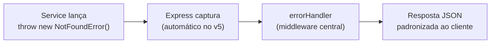
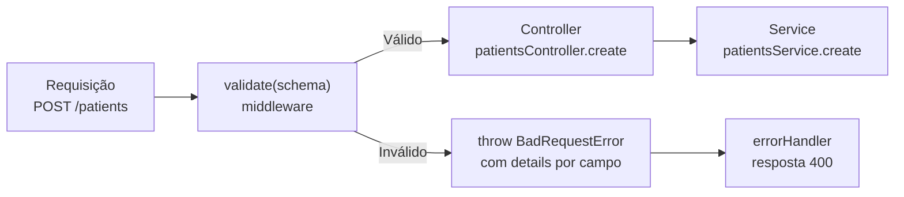
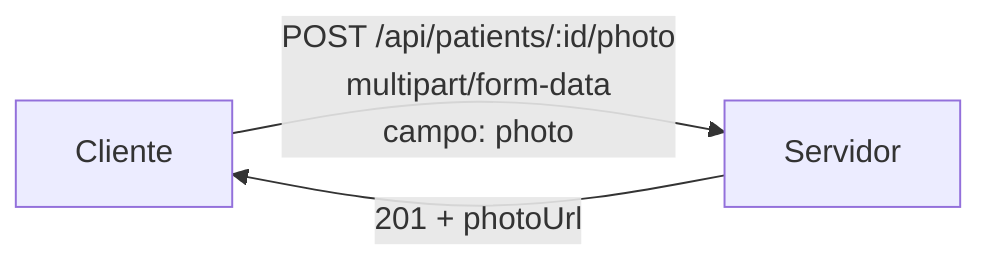
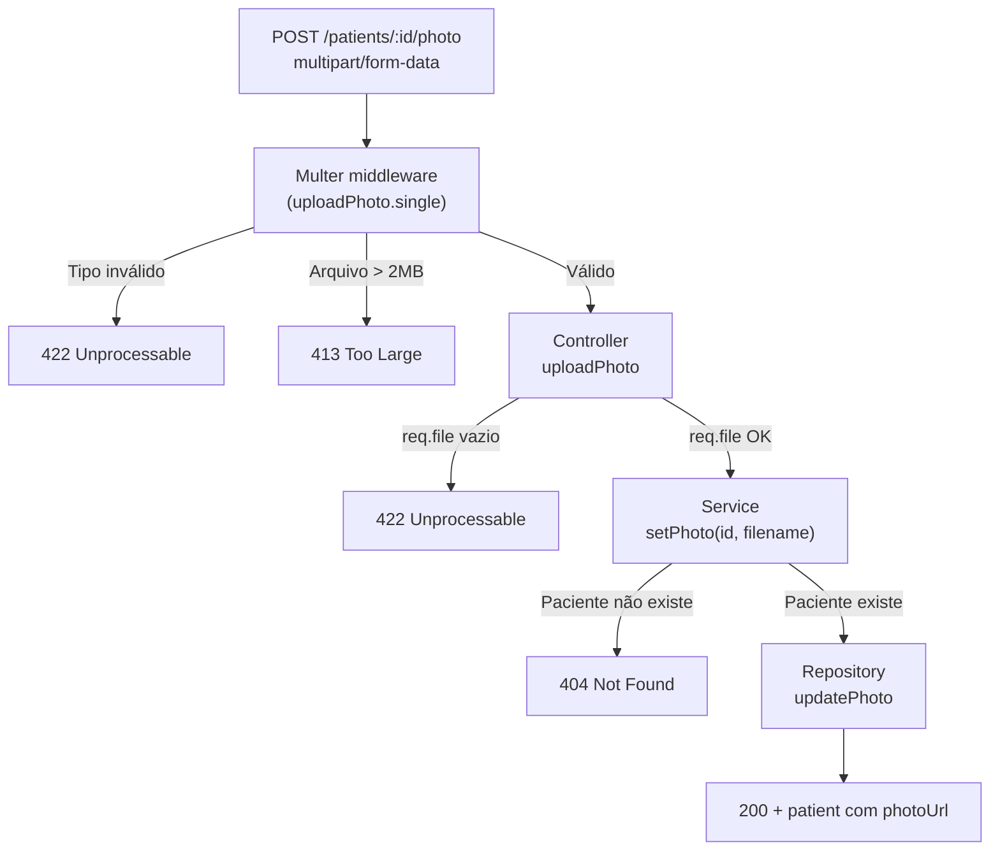
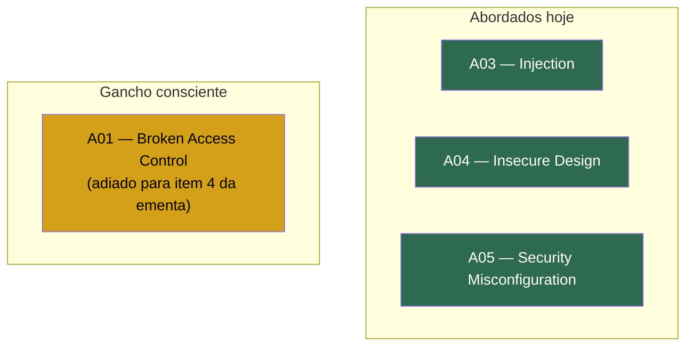
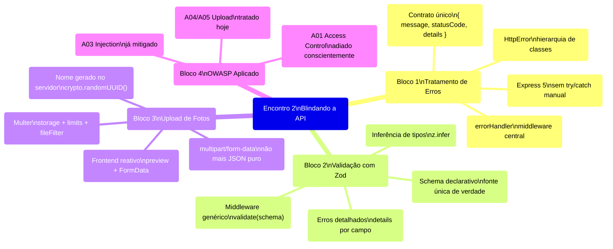

# 📘 Material Didático — Encontro 2: Blindando a API antes da Produção

**Disciplina:** Programação para Internet II (TEC.1052)
**Curso:** Análise e Desenvolvimento de Sistemas — IFPI — Módulo IV
**Semestre:** 2026.2
**Professor:** Rogério Silva

---

## 📋 Visão Geral do Encontro

| Aspecto | Detalhe |
|---|---|
| **Duração** | 2 horas de aula |
| **Blocos** | 4 blocos temáticos |
| **Práticas guiadas** | 3 (em dupla) |
| **ConcepTests** | 2 (votação em dupla) |

### Roteiro de Tempo

| Intervalo | Tema |
|---|---|
| 0–27 min | **Bloco 1** — Tratamento de Erros (HttpError + middleware central + Express 5) |
| 27–80 min | **Bloco 2** — Validação com Zod (schema declarativo + middleware genérico) |
| 80–112 min | **Bloco 3** — Upload de Fotos (multipart/form-data + Multer + preview no frontend) |
| 112–120 min | **Bloco 4** — OWASP aplicado (A01, A03, A04/A05) |

---

---

## Bloco 1 — Tratamento de Erros

### 1.1 O Problema: Respostas de Erro Inconsistentes

Quando uma API não tem um padrão unificado para respostas de erro, o resultado é caótico. Cada trecho do código responde de um jeito diferente:

```js
// Em um arquivo:
res.status(400).json({ error: 'nome obrigatorio' });

// Em outro arquivo, mesmo tipo de erro:
res.status(400).send('Requisicao invalida');

// E quando algo quebra de verdade:
res.status(500).json({ message: err.message, stack: err.stack }); // ⚠️ VAZA detalhe interno!
```

> [!CAUTION]
> Expor `err.stack` em produção é uma **falha de segurança**. O stack trace revela caminhos de arquivo, nomes de funções internas e estrutura do projeto — informações que um atacante pode usar para explorar vulnerabilidades.

**Consequências para quem consome a API:**
- Nunca sabe de antemão qual formato de erro vai receber
- Não consegue tratar erros programaticamente no frontend
- Pode receber informações internas sensíveis (stack trace)

---

### 1.2 Analogia: A Ouvidoria Única do Hospital

Para entender a solução, considere esta analogia:

| Sem Ouvidoria Única | Com Ouvidoria Única |
|---|---|
| Cada setor reclama do seu jeito | Toda reclamação sai pela mesma janela |
| A recepção te dá papel escrito à mão, a enfermagem te manda por e-mail, o financeiro te chama por telefone | Não importa onde o problema começou — a resposta tem sempre o mesmo formato, protocolo e clareza |

> [!IMPORTANT]
> O `errorHandler` é a **ouvidoria única da API**: não importa onde o erro nasceu, ele sai formatado sempre do mesmo jeito.

---

### 1.3 A Hierarquia de `HttpError`

A solução começa com uma **classe base de erro** e subclasses específicas para cada tipo de erro HTTP:

```typescript
// errors/HttpError.ts

class HttpError extends Error {
  constructor(
    public statusCode: number,
    message: string,
    public details?: unknown
  ) {
    super(message);
  }
}

class BadRequestError extends HttpError {
  constructor(msg = 'Requisicao invalida', details?: unknown) {
    super(400, msg, details);
  }
}

class NotFoundError extends HttpError {
  constructor(msg = 'Recurso nao encontrado') {
    super(404, msg);
  }
}

class ConflictError extends HttpError {
  constructor(msg = 'Conflito com o estado atual') {
    super(409, msg);
  }
}

class UnprocessableEntityError extends HttpError {
  constructor(msg = 'Nao foi possivel processar', details?: unknown) {
    super(422, msg, details);
  }
}

class PayloadTooLargeError extends HttpError {
  constructor(msg = 'Arquivo excede o tamanho permitido') {
    super(413, msg);
  }
}
```

**Vantagem:** cada subclasse já **sabe o próprio status code** — quem lança o erro não precisa lembrar o número.

#### Tabela de Referência dos Status Codes

| Classe | Status Code | Quando usar |
|---|---|---|
| `BadRequestError` | **400** | Payload malformado, campos inválidos, dados fora do formato esperado |
| `NotFoundError` | **404** | Recurso (paciente, registro, etc.) não existe no banco |
| `ConflictError` | **409** | Conflito com estado atual (ex.: CPF duplicado) |
| `PayloadTooLargeError` | **413** | Arquivo enviado excede o tamanho permitido |
| `UnprocessableEntityError` | **422** | Dados estão bem formados mas violam regra de negócio (ex.: tipo de arquivo inválido) |

---

### 1.4 O Middleware de Erro — A Ouvidoria em Código

O `errorHandler` é um middleware do Express que **centraliza** toda montagem de resposta de erro:

```typescript
// middlewares/errorHandler.ts

function errorHandler(err, req, res, next) {
  if (err instanceof HttpError) {
    return res.status(err.statusCode).json({
      error: {
        message: err.message,
        statusCode: err.statusCode,
        details: err.details ?? null,
      },
    });
  }

  // Erro inesperado: loga no servidor, NUNCA expõe ao cliente
  console.error(err);
  res.status(500).json({
    error: {
      message: 'Erro interno',
      statusCode: 500,
      details: null,
    },
  });
}
```

> [!TIP]
> É o **único lugar do projeto** que monta um JSON de erro. Nenhum Controller faz isso manualmente.

**Fluxo do erro na aplicação:**



---

### 1.5 Express 5: Sem try/catch em toda rota

Uma grande vantagem do Express 5 é que ele **propaga erros assíncronos automaticamente** para o `errorHandler`, eliminando o boilerplate de `try/catch`:

````carousel
**❌ Express 4 — try/catch manual**
```js
router.get('/patients/:id',
  async (req, res, next) => {
    try {
      const p = await service.find(req.params.id);
      res.json(p);
    } catch (err) {
      next(err);
    }
  }
);
```
<!-- slide -->
**✅ Express 5 — automático**
```js
router.get('/patients/:id',
  async (req, res) => {
    const p = await service.find(req.params.id);
    res.json(p);
  }
);
// rejeição vai direto para o errorHandler
```
````

O Service só precisa fazer `throw new NotFoundError()` — o resto é automático.

---

### 1.6 Antes e Depois — O que o Cliente Recebe

````carousel
**❌ ANTES — Erro expõe implementação interna**
```http
HTTP/1.1 500
{
  "message": "Cannot read property 'id' of undefined",
  "stack": "at Object.<anon>..."
}
```
<!-- slide -->
**✅ DEPOIS — Erro útil e seguro**
```http
HTTP/1.1 404
{
  "error": {
    "message": "Paciente nao encontrado",
    "statusCode": 404,
    "details": null
  }
}
```
````

> [!NOTE]
> Mesmo bug de origem, resposta completamente diferente: uma vaza implementação interna, a outra é **útil pra quem consome**.

---

### 1.7 Síntese do Bloco 1

> **Erro genérico 500 é preguiça de engenharia, não limitação da linguagem.**
>
> A partir de agora, todo erro no projeto tem nome, status code certo e uma resposta que serve pra alguma coisa.

---

### 🧪 ConcepTest 1 — Qual erro lançar?

**Cenário:** dentro de `patientsService.update(id, data)`, o paciente com esse `id` não existe no banco.

| Opção | Resposta |
|---|---|
| A) `throw new BadRequestError()` — 400 | ❌ 400 é para payload malformado, não recurso inexistente |
| B) `throw new NotFoundError()` — 404 | ✅ **Correto!** O recurso identificado pelo `id` não foi encontrado |
| C) `res.status(404).send()` diretamente no Service | ❌ O Service não deve conhecer `res` — essa é responsabilidade da camada HTTP |
| D) `throw new ConflictError()` — 409 | ❌ 409 é para conflito de estado (ex.: duplicata), não ausência |

---

### 🔨 Prática Guiada 1 — Implementar errorHandler.ts

**Objetivo:** Trocar todos os erros manuais por `throw new AlgumHttpError()`.

**Critério de "pronto":**
- Todo `res.status(...).json({ error: ... })` escrito manualmente em Controller ou Service vira um `throw new AlgumHttpError()`
- O `errorHandler.ts` é o **único lugar** do projeto que monta a resposta de erro

**Como testar:**
- Rodem o `requests.http` de novo — cada requisição que já dava erro antes precisa continuar dando o mesmo status code, agora no formato novo `{ error: { message, statusCode, details } }`

---

---

## Bloco 2 — Validação Profissional com Zod

### 2.1 O Problema: Validação Manual Espalhada

Quando a validação é feita com cadeias de `if` dentro do Service, surgem vários problemas:

```js
function create(data) {
  if (!data.name || typeof data.name !== 'string') throw new BadRequestError('nome invalido');
  if (!data.cpf || data.cpf.length !== 11)         throw new BadRequestError('cpf invalido');
  if (data.email && !data.email.includes('@'))      throw new BadRequestError('email invalido');
  // ... isso se repete, ligeiramente diferente, em update(), em outro Service...
}
```

**Problemas:**
- Cada `if` é uma chance de **esquecer** um campo
- Regras são **duplicadas** em `create()` e `update()`
- Validações podem ser **inconsistentes** entre diferentes partes do projeto
- Não há **inferência de tipos** — TypeScript não sabe o que foi validado

---

### 2.2 Analogia: O Controle de Qualidade na Entrada da Fábrica

| Sem Controle de Entrada | Com Controle de Entrada |
|---|---|
| Material ruim **entra** na linha | Material ruim **nem entra** |
| Uma peça com defeito passa pela recepção, avança por três estações de montagem, e só é descoberta lá no final — quando já gastou tempo e recurso de todo mundo | Um inspetor único, na porta, barra qualquer peça fora do padrão antes de ela consumir um segundo da linha de produção |

> [!IMPORTANT]
> O middleware de validação é esse inspetor: **payload inválido nunca chega ao Controller nem ao Service**.

---

### 2.3 Validação Declarativa com Zod

A abordagem declarativa substitui a cadeia de `if`s por um **schema** — uma descrição formal da forma que os dados devem ter:

````carousel
**❌ if em cadeia**
```js
if (!data.name) throw ...;
if (data.name.length > 120) throw ...;
if (!data.cpf) throw ...;
if (data.cpf.length !== 11) throw ...;
// ... continua
```
<!-- slide -->
**✅ Schema Zod**
```js
const schema = z.object({
  name:  z.string().max(120),
  cpf:   z.string().length(11),
  email: z.string().email().optional(),
});
```
````

> [!TIP]
> O schema é a **fonte única de verdade** — e ainda dá o tipo TypeScript de graça, via `z.infer<typeof schema>`.

#### O que é o Zod?

[Zod](https://zod.dev) é uma biblioteca TypeScript-first para declaração e validação de schemas. Ela permite:

1. **Declarar** a forma dos dados de forma concisa e legível
2. **Validar** dados em runtime com mensagens de erro detalhadas
3. **Inferir tipos TypeScript** automaticamente a partir do schema

---

### 2.4 Aplicação Prática — Schema de Paciente

```typescript
// validation/patients.schemas.ts

import { z } from 'zod';

export const createPatientSchema = z.object({
  name:  z.string().min(1, 'nome obrigatorio').max(120),
  cpf:   z.string().length(11, 'cpf precisa ter 11 digitos'),
  phone: z.string().optional(),
});

export type CreatePatientInput = z.infer<typeof createPatientSchema>;
```

**O que cada método faz:**

| Método Zod | O que valida |
|---|---|
| `z.string()` | Deve ser uma string |
| `.min(1, 'mensagem')` | Pelo menos 1 caractere (campo obrigatório) |
| `.max(120)` | No máximo 120 caracteres |
| `.length(11, 'mensagem')` | Exatamente 11 caracteres |
| `.optional()` | Campo não é obrigatório |
| `z.infer<typeof schema>` | Gera o tipo TypeScript automaticamente |

---

### 2.5 Middleware Genérico de Validação

O middleware `validate` é **genérico** — funciona com qualquer schema Zod:

```typescript
// middlewares/validate.ts

function validate(schema) {
  return (req, res, next) => {
    const result = schema.safeParse(req.body);
    if (!result.success) {
      throw new BadRequestError(
        'Payload invalido',
        result.error.flatten().fieldErrors
      );
    }
    req.body = result.data; // dados validados e tipados
    next();
  };
}

// Uso na rota:
router.post('/patients', validate(createPatientSchema), patientsController.create);
```

**Fluxo da validação:**



---

### 2.6 O que o Cliente Recebe na Validação

Quando a validação falha, o cliente recebe uma resposta **detalhada por campo**:

```http
HTTP/1.1 400
{
  "error": {
    "message": "Payload invalido",
    "statusCode": 400,
    "details": {
      "cpf": ["cpf precisa ter 11 digitos"]
    }
  }
}
```

> [!TIP]
> O campo `details` informa exatamente **qual campo** precisa ser corrigido — o cliente não precisa adivinhar.

---

### 🔨 Prática Guiada 2 — Validar com Zod

**Objetivo:** Implementar `createPatientSchema` com Zod.

**Critério de "pronto":**
- Todos os endpoints de escrita de Patient (criar e atualizar) passam por `validate(schema)` **antes** de chegar ao Controller
- Os `if`s manuais de validação **saem** do Service

**Como testar:**
- No `requests.http`, adicionem pelo menos **2 casos novos**:
  1. Payload com campo faltando → deve retornar **400** com `details`
  2. CPF de tamanho errado → deve retornar **400** com `details`

---

---

## Bloco 3 — Upload de Fotos

### 3.1 Por que Upload é Especial

Upload de arquivos é a funcionalidade que **força a arquitetura inteira a se justificar de uma vez**, porque ela exige:
- Um formato de requisição diferente (`multipart/form-data` em vez de JSON)
- Validação de tipo de arquivo e tamanho
- Geração segura de nomes de arquivo
- Integração ponta a ponta (backend + frontend)

---

### 3.2 Contrato da API



> [!NOTE]
> Diferente do JSON puro usado até agora — `multipart/form-data` é o formato **padrão de mercado** para envio de arquivo.

---

### 3.3 Regras Aplicadas em Camadas

Antes de salvar o arquivo, **várias validações** precisam passar, cada uma na camada adequada:

| Validação | Responsável | Erro se falhar |
|---|---|---|
| Paciente com `:id` existe | **Service** | 404 `NotFoundError` |
| Tipo é `image/jpeg` ou `image/png` | **middlewares/upload.ts** | 422 `UnprocessableEntityError` |
| Tamanho ≤ 2 MB | **middlewares/upload.ts** | 413 `PayloadTooLargeError` |
| Nome do arquivo gerado pelo servidor | **middlewares/upload.ts** | Previne **path traversal** |

---

### 3.4 Middleware de Upload com Multer

```typescript
// middlewares/upload.ts

const storage = multer.diskStorage({
  destination: 'uploads/',
  filename: (req, file, cb) =>
    cb(null, `${crypto.randomUUID()}${path.extname(file.originalname)}`),
});

const ALLOWED = ['image/jpeg', 'image/png'];

export const uploadPhoto = multer({
  storage,
  limits: { fileSize: 2 * 1024 * 1024 }, // 2 MB
  fileFilter: (req, file, cb) =>
    cb(null, ALLOWED.includes(file.mimetype)),
});
```

**Explicação linha a linha:**

| Trecho | O que faz |
|---|---|
| `multer.diskStorage(...)` | Configura onde e como salvar o arquivo no disco |
| `destination: 'uploads/'` | Pasta destino no servidor |
| `crypto.randomUUID()` | Gera um nome **aleatório e único** — ignora o nome do cliente |
| `path.extname(file.originalname)` | Preserva a extensão original (`.jpg`, `.png`) |
| `limits: { fileSize: ... }` | Limita o tamanho máximo a 2 MB |
| `fileFilter` | Aceita apenas `image/jpeg` e `image/png` |

---

### 3.5 Endpoint de Upload — Ponta a Ponta

````carousel
**Controller**
```typescript
// controllers/patients.controller.ts

export function uploadPhoto(req, res) {
  if (!req.file)
    throw new UnprocessableEntityError();

  const patient = patientsService.setPhoto(
    req.params.id,
    req.file.filename
  );

  res.status(200).json(patient);
}
```
<!-- slide -->
**Service**
```typescript
// services/patients.service.ts

export function setPhoto(id, filename) {
  const patient = findById(id);
  if (!patient)
    throw new NotFoundError();

  return repository.updatePhoto(
    id,
    `/uploads/${filename}`
  );
}
```
<!-- slide -->
**Rota**
```typescript
router.post(
  '/patients/:id/photo',
  uploadPhoto.single('photo'),
  patientsController.uploadPhoto
);
```
````

**Fluxo completo:**



---

### 3.6 🧪 ConcepTest 2 — Por que não confiar no nome do arquivo?

**Cenário:** um cliente malicioso envia um arquivo chamado `../../../../etc/passwd.jpg` no campo `photo`.

| Opção | Análise |
|---|---|
| A) Não tem problema, é só um nome de arquivo | ❌ Falso — nomes de arquivo são interpretados pelo sistema de arquivos |
| B) Se o servidor usar esse nome direto no disco, pode escrever fora da pasta de uploads (**path traversal**) | ✅ **Correto!** O atacante navega pela árvore de diretórios com `../` |
| C) O Multer já bloqueia isso sozinho, sem configuração | ❌ Depende da configuração — por isso geramos o nome com `crypto.randomUUID()` |

> [!WARNING]
> **Path traversal** é um ataque onde o nome de arquivo contém `../` para navegar para fora do diretório seguro. A mitigação é **nunca usar o nome original do cliente** — sempre gere o nome no servidor.

---

### 3.7 Frontend Reativo — Preview Local e Envio

O frontend precisa de duas capacidades:

**1. Preview local (antes do envio):**

```javascript
// public/js/patients.js

fileInput.addEventListener('change', () => {
  const file = fileInput.files[0];
  state.previewUrl = file ? URL.createObjectURL(file) : null;
  render(); // preview aparece antes de qualquer envio ao servidor
});
```

> [!TIP]
> `URL.createObjectURL(file)` cria uma URL temporária local — a foto aparece na tela **sem nenhuma requisição ao servidor**.

**2. Envio via FormData:**

```javascript
async function submitPhoto(patientId, file) {
  const formData = new FormData();
  formData.append('photo', file);

  const res = await fetch(
    `/api/patients/${patientId}/photo`,
    { method: 'POST', body: formData }
  );

  if (!res.ok) return renderApiError(await res.json());

  state.patient = await res.json();
  render();
}
```

---

### 3.8 Tratamento de Erro no Frontend

O frontend usa o **mesmo contrato de erro** definido no backend:

```javascript
// public/js/errors.js

function renderApiError(body) {
  const { message, details } = body.error;
  state.formError   = message;
  state.fieldErrors = details ?? {};
  render(); // um único ponto de entrada, igual ao resto do estado reativo
}
```

> [!IMPORTANT]
> O frontend nunca precisa adivinhar o formato do erro — ele é o mesmo contrato `{ message, statusCode, details }` de sempre. Essa consistência é consequência direta do `errorHandler` centralizado no backend.

---

### 🔨 Prática Guiada 3 — Upload ponta a ponta

**Critério de "pronto":**
- Foto válida → **201/200**
- Tipo errado → **422**
- Arquivo grande → **413**
- Paciente inexistente → **404**
- Frontend mostra preview antes de enviar e erro formatado se falhar

**Se sobrar tempo:**
- Enviar um arquivo `.txt` renomeado para `.jpg` — o filtro por **mimetype** (não só extensão) deveria pegar isso

---

---

## Bloco 4 — OWASP Aplicado

### 4.1 O que é OWASP?

A [OWASP](https://owasp.org) (Open Worldwide Application Security Project) mantém o **OWASP Top 10** — uma lista das 10 categorias de vulnerabilidades mais críticas em aplicações web. Este encontro aborda **três delas** na prática:



---

### 4.2 A03 — Injection (Retomada)

> Vocês já fazem certo desde a Semana 01.

SQL parametrizado já é, na prática, a mitigação de A03:

```js
// ✅ SEGURO — query parametrizada
db.prepare('... WHERE cpf = ?').get(cpf);

// ❌ INSEGURO — concatenação direta
db.prepare(`... WHERE cpf = '${cpf}'`).get(); // SQL Injection!
```

> [!NOTE]
> O ponto aqui não é aprender algo novo — é **nomear formalmente** o que já é hábito. Usar prepared statements com `?` impede que entrada do usuário seja interpretada como código SQL.

---

### 4.3 A04 / A05 — Unrestricted File Upload

O upload de fotos construído neste encontro já mitiga diversas vulnerabilidades:

| Mitigação implementada | Ataque que previne | Categoria OWASP |
|---|---|---|
| **Gerar nome no servidor** com `crypto.randomUUID()` | Path traversal (`../../etc/passwd`) | A04 / A05 |
| **Validar MIME type** (`image/jpeg`, `image/png`) | Upload de arquivos executáveis (.php, .exe) | A04 / A05 |
| **Validar extensão** (`path.extname`) | Disfarce de tipo de arquivo | A04 / A05 |
| **Limitar tamanho** (2 MB) | Negação de serviço (DoS) por upload gigante | A05 |

> [!WARNING]
> Validar **apenas a extensão** não é suficiente! Um arquivo `.txt` renomeado para `.jpg` engana quem checa só a extensão. Sempre valide o **MIME type** junto.

---

### 4.4 A01 — Broken Access Control (Gancho Consciente)

> Hoje, **qualquer um pode enviar foto para qualquer paciente**.

Isso só é aceitável porque **autenticação/autorização ainda não existe** no projeto-fio. Quando o item 4 da ementa chegar (Segurança completa), este endpoint muda: só quem tem permissão sobre aquele paciente poderá enviar a foto.

> [!IMPORTANT]
> **Deixar isso em aberto conscientemente é diferente de deixar por esquecimento** — e essa diferença é o que se espera de um Pleno/Sênior. Documentar decisões de segurança pendentes é uma prática de engenharia madura.

---

### 4.5 Síntese de Segurança

> **Segurança não é uma aula isolada — é uma pergunta em cada decisão.**

| Categoria OWASP | Status neste encontro |
|---|---|
| **A03** — Injection | ✅ Já mitigado (desde Semana 01) |
| **A04/A05** — Unrestricted Upload | ✅ Tratado no upload de hoje |
| **A01** — Broken Access Control | ⏳ Conscientemente adiado para item 4 da ementa |

---

---

## 🔑 Fechamento — O que Fica de Hoje

| # | Lição principal |
|---|---|
| 1 | **Erro genérico 500 é preguiça de engenharia** — todo erro agora tem nome e status certo |
| 2 | **Validação na fronteira** barra dado ruim antes de ele contaminar a regra de negócio |
| 3 | **Nome de arquivo do cliente nunca é confiável** — o servidor sempre gera o próprio nome |
| 4 | **Segurança é pergunta em cada decisão, não uma aula isolada** — hoje já mitigamos A03 e parte de A04/A05 |

---

## 🎫 Exit Ticket (sem nota)

Antes de sair, responda em uma frase:

1. **Qual foi o status code que você teve mais dúvida de escolher hoje** — 400, 404, 409, 413 ou 422 — e por quê?

2. **Se um colega te perguntasse "por que gerar o nome do arquivo no servidor?",** o que você responderia em uma frase?

---

## 📚 Referências e Próximos Passos

- **Zod:** [zod.dev](https://zod.dev)
- **Multer:** [expressjs/multer](https://github.com/expressjs/multer)
- **OWASP Top 10:** [owasp.org/Top10](https://owasp.org/www-project-top-ten/)
- **Express 5:** [expressjs.com/en/guide/migrating-5.html](https://expressjs.com/en/guide/migrating-5.html)

**Próximas semanas:**
- **Item 3** — Arquiteturas em Camadas (completo)
- **Item 4** — Segurança: Autenticação, Autorização e OWASP Top 10 na íntegra

---

## 📊 Mapa Conceitual do Encontro


